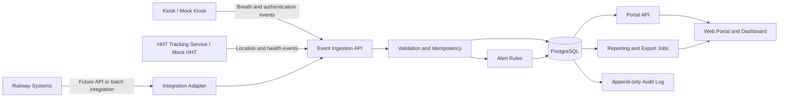
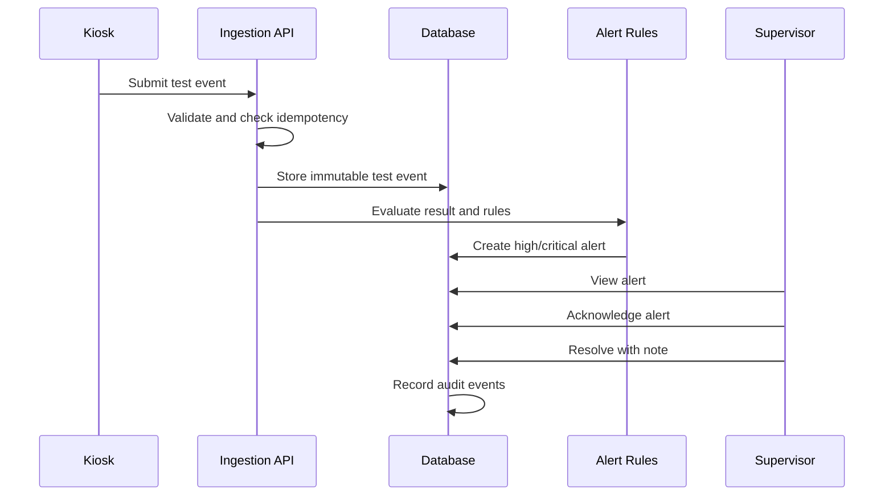

# Web Portal and Centralized Dashboard
## BRD, FRD, SRS and MVP Build Specification

**Project:** Integrated Biometric and Breath Alcohol Testing System

**Deployment context:** Hyderabad Division ticket-checking staff

**Document purpose:** This document defines only the web portal, centralized dashboard, backend APIs, data model, workflows, security, reports and MVP scope. It excludes kiosk hardware, kiosk firmware, biometric-engine implementation and the HHT mobile application itself.

**Build target:** Google Antigravity MVP implementation

**Version:** 1.0

---

# 1. Executive Summary

The web portal is the central administration, monitoring, reporting and audit platform for a Railway employee safety system.

The portal will receive and manage data from:

- Biometric and Breath Alcohol Testing kiosks.
- Existing Railway applications such as TTE Lobby, attendance and HRMS systems.
- HHT movement-tracking services.
- Administrative users and supervisors.

The MVP must enable authorized Railway users to:

- Manage employees, stations, units, kiosks and HHT devices.
- View Breath Alcohol test transactions.
- Monitor pass, fail, invalid and confirmatory tests.
- Receive and resolve alerts.
- View kiosk health and calibration status.
- View HHT locations and historical routes from available location data.
- Generate reports and export data.
- Manage users, roles and permissions.
- Maintain an immutable or append-only audit history.
- Configure basic thresholds, alert rules and tracking intervals.

The portal should be designed as a scalable, API-first system that can later support additional divisions, locations, kiosks, employees and Railway integrations.

---

# 2. Source Scope

The source procurement document requires a centralized web-based application/dashboard for administration and monitoring of employee authentication, Breath Alcohol results, attendance, device status, calibration, alerts, audit logs, maintenance and MIS reporting. It also requires employee and biometric-profile management, role-based access, API integration, scheduled backups, offline synchronization and scalable monitoring of multiple locations.

The source document also requires HHT tracking data such as device ID, employee ID, timestamp, coordinates, GPS accuracy, network status, battery status, device status, login/logout status and application status, with live tracking, historical route playback and configurable alerts.

The source requirements include secure audit trails, encryption, TLS-based communication, data ownership by Indian Railways, structured export and deployment on Railway-designated infrastructure where required.

---

# 3. Business Requirements Document

## 3.1 Business Problem

Railway officials need a single source of truth for monitoring staff authentication, Breath Alcohol testing, attendance, device health, calibration, alerts and HHT movement.

Without a centralized portal:

- Test records may remain distributed across devices.
- Supervisors may not receive timely alerts.
- Calibration and maintenance can be missed.
- Historical records are difficult to audit.
- Reports require manual consolidation.
- Access to sensitive biometric and location data is difficult to control.

## 3.2 Business Objectives

1. Centralize all operational and administrative records.
2. Improve visibility of failed, positive and invalid tests.
3. Reduce manual reporting and reconciliation.
4. Provide evidence-ready audit trails.
5. Improve kiosk availability and calibration compliance.
6. Provide secure access to employee, test and movement data.
7. Support future integration with Railway systems.
8. Create a usable MVP that can be demonstrated without live Railway integrations.

## 3.3 Stakeholders

| Stakeholder | Responsibility or interest |
|---|---|
| Divisional Railway administration | Overall governance and reporting |
| Chief Ticket Inspector or equivalent officer | Operational monitoring and escalation |
| ACM or designated supervisory officer | Review of failed/positive tests |
| Lobby supervisor | Employee and attendance operations |
| System administrator | Master data, users, configuration and support |
| IT/CRIS team | Infrastructure, integrations and cybersecurity |
| Maintenance team | Kiosk health, calibration and incidents |
| Ticket-checking staff | Subject of authentication and testing workflows |
| Auditor or inquiry officer | Historical evidence and audit records |

## 3.4 Business Success Metrics

| Metric | MVP target |
|---|---:|
| Dashboard page load for normal list pages | 3 seconds or less |
| Alert visibility after transaction ingestion | 30 seconds or less in the MVP environment |
| Successful creation of a test transaction through API | 99% of valid requests |
| Report export completion for 10,000 rows | 60 seconds or less |
| Unauthorized access to protected pages | 0 successful attempts in testing |
| Duplicate transaction creation during retry | 0 duplicates when same idempotency key is reused |
| Audit coverage for privileged actions | 100% |
| Successful offline transaction synchronization | 100% of valid queued transactions in test scenarios |

## 3.5 MVP Success Criteria

The MVP is successful when an administrator can configure the system, ingest simulated kiosk and HHT events, monitor the dashboard, review a failed test, acknowledge an alert, view device and calibration status, generate a report, export data and inspect the audit trail.

---

# 4. MVP Scope

## 4.1 In Scope

- Responsive web portal.
- Secure login and session management.
- Role-based access control.
- Dashboard cards and operational charts.
- Employee master-data management.
- Station, unit and location master data.
- Kiosk and HHT device registry.
- Breath Alcohol test transaction ingestion and viewing.
- Authentication-event viewing.
- Attendance summary.
- Alert generation, acknowledgement and assignment.
- Calibration records and reminders.
- Device health records and status.
- HHT location-event ingestion, map view and history table.
- Reports and CSV export.
- Audit log.
- Basic system configuration.
- REST API with OpenAPI documentation.
- Seed data and mock event generator for demonstration.
- Basic automated tests.

## 4.2 Out of Scope for MVP

- Building kiosk hardware or firmware.
- Developing the HHT mobile application.
- Direct integration with live TTE Lobby, HRMS or Railway systems.
- Production biometric matching.
- Production facial-recognition model training.
- Clinical or legal determination of employee fitness.
- Automated disciplinary action.
- Advanced AI such as fatigue detection, drowsiness detection or deepfake detection.
- SMS gateway billing and production email delivery.
- Native mobile app for administrators.
- Complex geospatial analytics.
- Multi-division deployment approval workflows.
- Digital signature infrastructure unless supplied later.

The MVP must expose clean integration points for these future capabilities.

---

# 5. User Roles and Permissions

## 5.1 Roles

### System Administrator

- Manage all master data.
- Manage users, roles and permissions.
- Configure thresholds, alerts and system settings.
- View all records.
- Export reports.
- View audit logs.

### Divisional Administrator

- Manage employees, stations, kiosks and HHT devices within assigned division.
- View and export operational records.
- Manage alerts and calibration records.
- Cannot manage platform-level security settings unless explicitly granted.

### Supervisor

- View employees and tests within assigned units.
- View live dashboard and alerts.
- Acknowledge and resolve alerts.
- View attendance and device status.
- Export permitted reports.
- Cannot delete records or change system-wide thresholds.

### Maintenance Officer

- View assigned devices.
- View device-health events and calibration schedules.
- Create and update maintenance tickets.
- Upload calibration certificates.
- Cannot view unnecessary employee personal data.

### Auditor / Read-only Officer

- View historical records, reports and audit logs.
- Export approved reports.
- Cannot modify operational data.

### API Service Account

- Ingest device and integration events.
- Read only the data required by a connected service.
- Use scoped credentials.
- Cannot access the interactive portal.

## 5.2 Permission Model

Use permission-based authorization rather than hard-coding role names in the frontend.

Recommended permissions:

- `dashboard.view`
- `employee.view`
- `employee.create`
- `employee.update`
- `employee.deactivate`
- `device.view`
- `device.manage`
- `test.view`
- `test.export`
- `alert.view`
- `alert.acknowledge`
- `alert.resolve`
- `calibration.view`
- `calibration.manage`
- `hht.view`
- `hht.history.view`
- `report.view`
- `report.export`
- `user.manage`
- `configuration.manage`
- `audit.view`

Every API endpoint must verify permission on the server.

---

# 6. Functional Requirements Document

## FR-001 Authentication

The system shall provide secure login for authorized portal users.

Acceptance criteria:

- Invalid credentials are rejected.
- Successful login creates a secure session.
- Logout invalidates the session.
- Inactive users cannot log in.
- Login success and failure are logged.
- Passwords are never stored in plain text.
- The interface supports future SSO integration.

## FR-002 User and Role Management

The system shall allow authorized administrators to create, activate, deactivate and update portal users.

Each user shall have:

- User ID.
- Full name.
- Email.
- Mobile number, if required.
- Role.
- Assigned division.
- Assigned station or unit.
- Status.
- Last login.
- Created date.
- Updated date.

All privileged changes must generate audit events.

## FR-003 Employee Master Data

The system shall provide employee management with:

- Employee ID.
- HRMS ID.
- Employee name.
- Designation.
- Department or category.
- Division.
- Station, lobby or unit.
- HHT ID.
- Authentication profile status.
- Employment status.
- Joining date, if available.
- Transfer or relieving date, if applicable.
- Contact details only where authorized.
- Created and updated timestamps.

Supported statuses:

- Active.
- Transferred.
- Relieved.
- Retired.
- Inactive.

The system shall preserve historical associations and shall not physically delete employees that have linked transactions.

## FR-004 Bulk Employee Import

Authorized users shall be able to upload CSV files.

The import process shall:

1. Validate file type and headers.
2. Validate required fields.
3. Detect duplicate employee IDs.
4. Detect invalid station, division and status values.
5. Show a row-level error report.
6. Support preview before commit.
7. Commit valid rows only after confirmation.
8. Record the import summary in the audit log.

## FR-005 Station, Unit and Location Master

The portal shall manage:

- Division.
- Station.
- Lobby.
- Unit.
- Address.
- Latitude and longitude.
- Status.
- Time zone.
- Contact person.

The MVP may use a simple hierarchy:

`Division → Station → Lobby/Unit`

## FR-006 Kiosk Registry

The portal shall maintain a registry of all kiosks.

Fields:

- Kiosk ID.
- Serial number.
- OEM.
- Model.
- Firmware version.
- Assigned location.
- Installation date.
- Warranty start and end dates.
- Last-seen timestamp.
- Current status.
- Calibration status.
- Network status.
- Last health-check timestamp.
- Notes.

Statuses:

- Online.
- Offline.
- Maintenance.
- Fault.
- Retired.

## FR-007 HHT Registry

The portal shall maintain a registry of HHT devices.

Fields:

- HHT ID.
- Device serial number.
- Assigned employee.
- Assigned station or unit.
- Operating-system version.
- Application version.
- Last location timestamp.
- Last-seen timestamp.
- Battery percentage.
- GPS status.
- Network status.
- Device status.
- Assignment history.

## FR-008 Breath Alcohol Test Ingestion

The backend shall provide an API to receive a test transaction from a kiosk or integration service.

Each transaction should contain:

- Unique test ID.
- Employee ID.
- Kiosk ID.
- Station or location ID.
- Test timestamp.
- Measured value.
- Unit.
- Pass/fail result.
- Test status.
- Test sequence number.
- Confirmatory-test reference, if applicable.
- Captured-image reference, if supplied.
- Authentication method.
- Authentication result.
- Device firmware version.
- Calibration reference.
- GPS coordinates, if available.
- Source-system transaction ID.
- Created timestamp.

Permitted test statuses:

- Pass.
- Fail.
- Invalid sample.
- Insufficient sample.
- Pending review.
- Confirmatory test.
- Cancelled.
- Device error.

Requirements:

- The test ID must be unique.
- Repeated delivery of the same source transaction must be idempotent.
- Historical test results must not be edited through normal user screens.
- Corrections must be recorded as a new adjustment or review event.
- Every transaction must preserve the original received payload or a secure hash/reference.

## FR-009 Breath Alcohol Test List

The portal shall show a searchable and filterable test list.

Filters:

- Date range.
- Employee.
- Employee ID.
- Test result.
- Test status.
- Kiosk.
- Station or unit.
- Location.
- Confirmatory-test status.
- Calibration status.

Columns:

- Test ID.
- Employee.
- Date and time.
- Kiosk.
- Location.
- Measured value.
- Unit.
- Result.
- Status.
- Image availability.
- Alert status.
- Review status.

The page shall provide a detail view with the complete event timeline and linked image, if available.

## FR-010 Test Detail and Review

The test-detail page shall display:

- Employee information permitted for the viewer.
- Test values and units.
- Threshold used.
- Kiosk and location.
- Authentication outcome.
- Test sequence.
- Linked image.
- Device health at time of test.
- Calibration validity at time of test.
- Alerts generated.
- Confirmatory tests.
- Review notes.
- Audit history.

The portal shall not allow an ordinary user to overwrite the original test result.

## FR-011 Attendance

The MVP shall provide an attendance summary based on received authentication and test events.

Minimum fields:

- Employee.
- Date.
- First authentication time.
- Last authentication time.
- Breath-test status.
- Attendance status.
- Exception reason.
- Supervisor review status.

Attendance statuses:

- Present.
- Present after exception.
- Failed test.
- Missing test.
- Pending review.
- Not applicable.

The attendance module must remain configurable because the final Railway attendance policy may differ.

## FR-012 Alerts

The system shall create alerts for configurable events.

Initial alert types:

- Positive or failed Breath Alcohol test.
- Repeated failed test.
- Invalid or insufficient sample.
- Kiosk offline.
- Kiosk fault.
- Calibration due.
- Calibration expired.
- HHT offline.
- GPS disabled.
- Location permission disabled.
- Low battery.
- Application stopped.
- Network unavailable.
- Integration failure.
- Security event.

Alert fields:

- Alert ID.
- Alert type.
- Severity.
- Source type.
- Source ID.
- Employee ID, if applicable.
- Location.
- Created time.
- Assigned user or group.
- Status.
- Acknowledged time.
- Resolved time.
- Resolution note.

Alert statuses:

- New.
- Acknowledged.
- Assigned.
- In progress.
- Resolved.
- Closed.
- Suppressed.

Severity levels:

- Critical.
- High.
- Medium.
- Low.

Authorized supervisors shall be able to acknowledge, assign and resolve alerts. Resolution requires a note.

## FR-013 Device Health

The portal shall display current and historical health information for kiosks and HHTs.

Kiosk health fields:

- CPU usage.
- Memory usage.
- Storage usage.
- Camera status.
- Breath sensor status.
- Network status.
- Power status.
- Tamper status.
- Firmware version.
- Last health check.

HHT health fields:

- Battery percentage.
- GPS status.
- Network status.
- Application status.
- Device status.
- Last heartbeat.
- Application version.
- Operating-system version.

The portal shall show a health timeline and allow filtering by device and date range.

## FR-014 Calibration Management

The system shall manage Breath Alcohol sensor calibration records.

Fields:

- Calibration record ID.
- Kiosk ID.
- Sensor serial number.
- Calibration date.
- Calibration due date.
- Calibration agency or technician.
- Certificate number.
- Certificate attachment.
- Calibration result.
- Remarks.
- Created by.
- Created time.

Rules:

- Generate a reminder before the due date.
- Generate an expired-calibration alert after the due date.
- Display calibration status on the kiosk list and dashboard.
- Preserve old calibration records.
- Do not allow deletion after the record is linked to a test.

## FR-015 HHT Location Data

The backend shall accept location events from authorized HHT services.

Each location event should contain:

- Event ID.
- HHT ID.
- Employee ID, if mapped.
- Timestamp.
- Latitude.
- Longitude.
- GPS accuracy.
- Battery percentage.
- Network status.
- Device status.
- Application status.
- Source transaction ID.

The portal shall provide:

- Latest location for each authorized HHT.
- Map view.
- Historical location table.
- Route playback or ordered route points for MVP.
- Date/time filtering.
- Employee and HHT filtering.
- Export of permitted location data.

Location data must be restricted to authorized users.

## FR-016 Dashboard

The dashboard shall provide date-range and organizational filters.

Recommended KPI cards:

- Total tests.
- Pass tests.
- Failed or positive tests.
- Invalid tests.
- Employees tested.
- Attendance exceptions.
- Online kiosks.
- Offline kiosks.
- Calibration due.
- Open critical alerts.
- Active HHTs.
- HHTs with stale locations.

Recommended visualizations:

- Tests by day.
- Pass/fail trend.
- Tests by station.
- Alert severity distribution.
- Kiosk availability.
- Calibration status.
- HHT activity summary.

Dashboard data must respect the logged-in user’s division, station and role scope.

## FR-017 Reports

The MVP shall provide reports for:

1. Daily Breath Alcohol test report.
2. Failed and positive test report.
3. Invalid and repeated test report.
4. Employee-wise test history.
5. Kiosk-wise test report.
6. Station-wise summary.
7. Attendance exception report.
8. Calibration due and expired report.
9. Device health report.
10. Alert and resolution report.
11. HHT location history report.
12. User activity and audit report.

Each report shall support filters, on-screen preview and CSV export. PDF export may be implemented after the core MVP if time is limited.

## FR-018 Audit Log

The system shall record:

- Login and logout.
- Failed login.
- User creation and modification.
- Role and permission changes.
- Employee creation and modification.
- Device changes.
- Configuration changes.
- Test review actions.
- Manual attendance or override actions.
- Alert acknowledgement and resolution.
- Calibration record creation.
- Export requests.
- API authentication failures.
- Data-import operations.

Audit fields:

- Event ID.
- Actor user ID or service account.
- Event type.
- Entity type.
- Entity ID.
- Before value hash or summary, where applicable.
- After value hash or summary, where applicable.
- IP address.
- User agent.
- Timestamp.
- Correlation ID.

Audit records should be append-only for normal users.

## FR-019 Configuration

Authorized administrators shall configure:

- Pass/fail threshold.
- Units of measurement.
- Alert severity mapping.
- Alert recipients or assignment groups.
- Calibration reminder period.
- Device-offline duration.
- HHT stale-location duration.
- Dashboard refresh interval.
- Data-retention settings.
- Supported language labels.

All configuration changes must be audited and versioned.

## FR-020 Notifications

For MVP, notifications may be implemented as in-portal alerts.

The architecture shall support future:

- Email notifications.
- SMS notifications.
- Webhooks.
- Railway notification services.

Notification attempts, status and failures should be logged.

## FR-021 Data Export

Authorized users shall export filtered records in CSV format.

Exports shall:

- Apply the same access restrictions as the screen.
- Record export activity in the audit log.
- Include report name, filters and generation time.
- Avoid exposing hidden fields.
- Apply a maximum row limit or asynchronous job for large exports.

## FR-022 API Integration

The system shall expose documented REST APIs for:

- Authentication.
- Employee master data.
- Kiosk health.
- HHT health.
- Breath Alcohol tests.
- Attendance events.
- HHT location events.
- Alerts.
- Calibration records.
- Reports or export jobs.

The API shall support:

- JSON payloads.
- Versioning, for example `/api/v1`.
- OAuth2 or signed service credentials for production integration.
- API keys only for local MVP demonstration if clearly marked as temporary.
- Idempotency keys for event ingestion.
- Pagination.
- Filtering.
- Validation errors.
- Correlation IDs.
- Rate limiting.
- Structured logs.

## FR-023 Mock Data and Demonstration Mode

Because live Railway integrations may not be available during MVP development, provide:

- Seed users for each role.
- Seed divisions, stations and devices.
- At least 30 employees.
- At least 5 kiosks.
- At least 20 HHT devices.
- At least 500 test events.
- Failed, pass, invalid and confirmatory examples.
- Calibration due and expired examples.
- Online and offline device examples.
- Location history for multiple HHTs.
- A mock event generator or admin-only “simulate event” function.

Simulation functions must be disabled or protected in production.

---

# 7. Non-Functional Requirements

## NFR-001 Security

- Enforce server-side authorization on every protected API.
- Hash passwords using a modern password-hashing algorithm.
- Use secure, HttpOnly and SameSite cookies or an approved token strategy.
- Protect against SQL injection, XSS, CSRF and insecure direct object references.
- Validate and sanitize all input.
- Never expose secrets in frontend code.
- Store secrets in environment variables or a secret manager.
- Log security-relevant events.
- Use TLS in deployed environments.
- Separate development, test and production credentials.

## NFR-002 Privacy

- Collect only data required for the business process.
- Restrict biometric, image and GPS data by role.
- Mask sensitive fields where full values are not required.
- Do not use biometric or location data for unrelated purposes.
- Provide configurable retention and archival controls.
- Record access to sensitive records.
- Support data export and controlled deletion only according to Railway policy.

## NFR-003 Availability and Recovery

The target architecture should support:

- 99.5% availability after production hardening.
- Scheduled database backups.
- Backup verification.
- Defined recovery point objective.
- Defined recovery time objective.
- Health checks for application and database.
- Monitoring of background jobs.

For MVP, document the chosen backup and recovery approach even if it is not fully automated.

## NFR-004 Performance

- List pages must use server-side pagination.
- Charts must use aggregated queries.
- Large exports must run asynchronously.
- Avoid loading all test or location records into the browser.
- Use indexes for date, employee, device, station and status fields.

## NFR-005 Usability

- Responsive on desktop and tablet.
- Clear status colors with text labels as well.
- Keyboard-accessible controls.
- Consistent date and time display.
- IST display for the target deployment unless configured otherwise.
- Clear error messages.
- Confirmation for destructive or privileged actions.
- Empty, loading and error states on all data screens.

## NFR-006 Maintainability

- Modular frontend components.
- Modular backend services.
- Database migrations.
- Environment-specific configuration.
- OpenAPI documentation.
- Automated linting and tests.
- Structured application logs.
- Clear README and deployment instructions.

## NFR-007 Scalability

The architecture should support future growth in:

- Divisions.
- Stations.
- Employees.
- Kiosks.
- HHT devices.
- Daily test events.
- Historical location records.
- External integrations.

---

# 8. Recommended MVP Technical Architecture

## 8.1 Preferred Stack

Use a stack that can be rapidly built and maintained:

- Frontend: React with TypeScript.
- UI: Tailwind CSS and a reusable component library.
- Charts: Recharts or equivalent.
- Maps: Leaflet with OpenStreetMap-compatible tiles for development.
- Backend: FastAPI with Python, or another typed REST backend.
- Database: PostgreSQL.
- Authentication: Supabase Auth or equivalent managed identity provider.
- File storage: Object storage for calibration certificates and permitted images.
- API documentation: OpenAPI/Swagger.
- Deployment: Vercel for frontend and a suitable managed backend platform, or a single deployable full-stack environment.

If Google Antigravity selects another stack, it must preserve the API, security, data-model and acceptance requirements in this document.

## 8.2 Logical Components

1. Web frontend.
2. Authentication and authorization service.
3. Core application API.
4. Event-ingestion API.
5. Alert and rules service.
6. Reporting service.
7. Audit service.
8. Background-job worker.
9. PostgreSQL database.
10. Object storage.
11. External integration adapters.

## 8.3 Data Flow



---

# 9. Data Model

## 9.1 Core Tables

### `divisions`

- `id`
- `code`
- `name`
- `status`
- `created_at`
- `updated_at`

### `locations`

- `id`
- `division_id`
- `parent_location_id`
- `location_type`
- `code`
- `name`
- `address`
- `latitude`
- `longitude`
- `status`
- `created_at`
- `updated_at`

### `employees`

- `id`
- `employee_code`
- `hrms_id`
- `full_name`
- `designation`
- `division_id`
- `location_id`
- `employment_status`
- `authentication_profile_status`
- `hht_id`
- `effective_from`
- `effective_to`
- `created_at`
- `updated_at`

### `portal_users`

- `id`
- `auth_user_id`
- `full_name`
- `email`
- `mobile`
- `status`
- `division_id`
- `location_id`
- `last_login_at`
- `created_at`
- `updated_at`

### `roles`

- `id`
- `name`
- `description`

### `permissions`

- `id`
- `code`
- `description`

### `user_roles`

- `user_id`
- `role_id`

### `role_permissions`

- `role_id`
- `permission_id`

### `kiosks`

- `id`
- `kiosk_code`
- `serial_number`
- `oem`
- `model`
- `firmware_version`
- `location_id`
- `status`
- `installed_at`
- `warranty_start`
- `warranty_end`
- `last_seen_at`
- `last_health_status`
- `created_at`
- `updated_at`

### `hht_devices`

- `id`
- `hht_code`
- `serial_number`
- `employee_id`
- `location_id`
- `os_version`
- `app_version`
- `status`
- `last_seen_at`
- `last_location_at`
- `created_at`
- `updated_at`

### `breath_tests`

- `id`
- `external_test_id`
- `employee_id`
- `kiosk_id`
- `location_id`
- `tested_at`
- `measured_value`
- `measurement_unit`
- `threshold_value`
- `result`
- `test_status`
- `sequence_number`
- `confirmatory_of_id`
- `image_object_key`
- `authentication_method`
- `authentication_result`
- `calibration_record_id`
- `source_payload_hash`
- `created_at`

### `attendance_records`

- `id`
- `employee_id`
- `attendance_date`
- `first_authentication_at`
- `last_authentication_at`
- `breath_test_status`
- `attendance_status`
- `exception_reason`
- `review_status`
- `created_at`
- `updated_at`

### `alerts`

- `id`
- `alert_type`
- `severity`
- `source_type`
- `source_id`
- `employee_id`
- `location_id`
- `status`
- `assigned_to`
- `created_at`
- `acknowledged_at`
- `resolved_at`
- `resolution_note`

### `calibration_records`

- `id`
- `kiosk_id`
- `sensor_serial_number`
- `calibrated_at`
- `due_at`
- `agency`
- `technician`
- `certificate_number`
- `certificate_object_key`
- `result`
- `remarks`
- `created_by`
- `created_at`

### `device_health_events`

- `id`
- `device_type`
- `device_id`
- `recorded_at`
- `cpu_usage`
- `memory_usage`
- `storage_usage`
- `camera_status`
- `sensor_status`
- `power_status`
- `tamper_status`
- `battery_percentage`
- `gps_status`
- `network_status`
- `application_status`
- `raw_payload_hash`

### `hht_location_events`

- `id`
- `external_event_id`
- `hht_id`
- `employee_id`
- `recorded_at`
- `latitude`
- `longitude`
- `gps_accuracy`
- `battery_percentage`
- `network_status`
- `device_status`
- `application_status`
- `source_payload_hash`
- `created_at`

### `audit_events`

- `id`
- `actor_type`
- `actor_id`
- `event_type`
- `entity_type`
- `entity_id`
- `before_summary`
- `after_summary`
- `ip_address`
- `user_agent`
- `correlation_id`
- `created_at`

### `system_configurations`

- `id`
- `config_key`
- `config_value`
- `value_type`
- `version`
- `updated_by`
- `updated_at`

### `import_jobs`

- `id`
- `job_type`
- `file_object_key`
- `status`
- `total_rows`
- `valid_rows`
- `invalid_rows`
- `error_report_object_key`
- `created_by`
- `created_at`
- `completed_at`

### `export_jobs`

- `id`
- `report_type`
- `filters_json`
- `status`
- `file_object_key`
- `requested_by`
- `created_at`
- `completed_at`

## 9.2 Data Integrity Rules

- Use UUIDs or secure non-sequential identifiers for external references.
- Add unique constraints to employee codes, kiosk codes, HHT codes and external event IDs.
- Use foreign keys for all master-data relationships.
- Use soft deactivation rather than destructive deletion for employees and devices with history.
- Store timestamps in UTC and display in configured local time.
- Use decimal or integer representation appropriate to the measurement unit; do not use floating-point values for legally or operationally important measurements without an explicit precision policy.
- Index `tested_at`, `employee_id`, `kiosk_id`, `location_id`, `result`, `status` and `recorded_at`.

---

# 10. API Specification

## 10.1 Common API Rules

Base path: `/api/v1`

Response format:

```json
{
  "data": {},
  "meta": {
    "request_id": "request-id"
  },
  "error": null
}
```

Error format:

```json
{
  "data": null,
  "meta": {
    "request_id": "request-id"
  },
  "error": {
    "code": "VALIDATION_ERROR",
    "message": "One or more fields are invalid",
    "fields": {
      "employee_id": "Employee does not exist"
    }
  }
}
```

## 10.2 Portal APIs

- `GET /dashboard/summary`
- `GET /dashboard/trends`
- `GET /employees`
- `POST /employees`
- `GET /employees/{id}`
- `PATCH /employees/{id}`
- `POST /employees/import`
- `GET /locations`
- `POST /locations`
- `GET /kiosks`
- `POST /kiosks`
- `PATCH /kiosks/{id}`
- `GET /hhts`
- `POST /hhts`
- `PATCH /hhts/{id}`
- `GET /breath-tests`
- `GET /breath-tests/{id}`
- `GET /attendance`
- `GET /alerts`
- `PATCH /alerts/{id}/acknowledge`
- `PATCH /alerts/{id}/assign`
- `PATCH /alerts/{id}/resolve`
- `GET /calibrations`
- `POST /calibrations`
- `GET /devices/{type}/{id}/health`
- `GET /hhts/{id}/locations`
- `GET /reports/{report_type}`
- `POST /exports`
- `GET /exports/{id}`
- `GET /audit-events`
- `GET /configurations`
- `PATCH /configurations/{key}`

## 10.3 Ingestion APIs

- `POST /ingestion/breath-tests`
- `POST /ingestion/authentication-events`
- `POST /ingestion/device-health`
- `POST /ingestion/hht-locations`
- `POST /ingestion/attendance-events`

Ingestion requirements:

- Require service authentication.
- Require `Idempotency-Key` or an external event ID.
- Validate schema and field ranges.
- Return `202 Accepted` for queued processing or `201 Created` for immediate processing.
- Return a duplicate-safe response when the same event is submitted again.
- Store a correlation ID.
- Do not expose internal stack traces.

Example Breath Alcohol event:

```json
{
  "external_test_id": "KIOSK-001-20260826-000123",
  "employee_id": "TTE-1001",
  "kiosk_id": "KIOSK-001",
  "location_id": "LOC-001",
  "tested_at": "2026-08-26T08:15:00+05:30",
  "measured_value": 0,
  "measurement_unit": "mg/100ml",
  "threshold_value": 30,
  "result": "PASS",
  "test_status": "VALID",
  "sequence_number": 1,
  "authentication_method": "BIOMETRIC",
  "authentication_result": "SUCCESS",
  "calibration_reference": "CAL-001",
  "image_object_key": "tests/2026/08/26/test-image.jpg"
}
```

Example HHT location event:

```json
{
  "external_event_id": "HHT-0001-20260826T081500Z",
  "hht_id": "HHT-0001",
  "employee_id": "TTE-1001",
  "recorded_at": "2026-08-26T08:15:00Z",
  "latitude": 17.4483,
  "longitude": 78.3915,
  "gps_accuracy": 12.4,
  "battery_percentage": 78,
  "network_status": "ONLINE",
  "device_status": "ACTIVE",
  "application_status": "RUNNING"
}
```

---

# 11. Portal Screens

## 11.1 Login

- Email or user ID.
- Password.
- Login button.
- Error message.
- Forgot-password placeholder.
- Version and environment indicator for non-production environments.

## 11.2 Dashboard

- Header with user, role, division and logout.
- Date-range filter.
- Division, station and unit filters.
- KPI cards.
- Test trend chart.
- Alert list.
- Device-status summary.
- Calibration summary.
- HHT activity summary.
- Recent audit activity for privileged users.

## 11.3 Employees

- Search, filter and pagination.
- Add employee.
- Edit employee.
- Activate/deactivate.
- Import CSV.
- Employee detail.
- Test history.
- Attendance history.
- HHT assignment history.

## 11.4 Breath Alcohol Tests

- List and filters.
- Status badges.
- Test detail.
- Image preview subject to permission.
- Linked alerts.
- Confirmatory-test relationship.
- Export.

## 11.5 Alerts

- Filter by severity, status, type, date, station and assignee.
- Alert detail.
- Acknowledge.
- Assign.
- Resolve with mandatory note.
- Timeline.

## 11.6 Devices

Tabs:

- Kiosks.
- HHT devices.
- Device health.
- Calibration.

Each device detail page shall show identity, assignment, status, last seen, recent events and history.

## 11.7 HHT Tracking

- Map with latest device locations.
- Device and employee filters.
- Date/time range.
- Location history table.
- Route line for selected device.
- Stale-location indicator.

## 11.8 Reports

- Report catalogue.
- Filter form.
- Preview table.
- Export button.
- Export history.

## 11.9 Administration

- Users.
- Roles and permissions.
- Locations.
- System configuration.
- Integration credentials placeholder.
- Audit log.

---

# 12. Key Workflows

## 12.1 Positive or Failed Test



## 12.2 Calibration Reminder

1. Scheduler checks calibration due dates.
2. System creates a reminder alert before the configured due date.
3. System creates an expired-calibration alert after the due date.
4. Dashboard displays affected kiosks.
5. Maintenance Officer uploads a new certificate.
6. Authorized administrator verifies and saves the calibration record.
7. Alert is resolved and audit event is created.

## 12.3 Employee Import

1. Administrator downloads template.
2. Administrator uploads CSV.
3. System validates the file.
4. System shows valid and invalid rows.
5. Administrator confirms import.
6. Valid records are committed.
7. Error file is available for download.
8. Import summary is written to the audit log.

## 12.4 HHT Offline Synchronization

1. HHT service submits queued events after network recovery.
2. API validates each event.
3. Existing external event IDs are ignored as duplicates.
4. New events are stored.
5. Latest HHT status is updated.
6. Dashboard reflects the latest synchronized location.
7. Synchronization results are available in integration logs.

## 12.5 Manual Exception or Override

1. Authorized supervisor opens the affected attendance or test record.
2. Supervisor selects an allowed exception type.
3. Supervisor enters a mandatory reason.
4. System records the action as a new review/override event.
5. Original event remains unchanged.
6. Audit log records actor, time, reason and affected record.

---

# 13. Validation and Business Rules

- Employee ID must exist before accepting a test, unless the event is placed in an exception queue.
- Kiosk ID must exist and be active before accepting a test, unless integration policy allows deferred registration.
- HHT ID must exist before accepting location data.
- Latitude must be between -90 and 90.
- Longitude must be between -180 and 180.
- Battery percentage must be between 0 and 100.
- GPS accuracy cannot be negative.
- Test timestamps cannot be unreasonably far in the future.
- Duplicate external event IDs must be idempotent.
- A test linked to an expired calibration must generate an alert or review flag.
- A resolved alert must contain a resolution note.
- An override must contain a reason and authorized actor.
- Historical test transactions cannot be deleted through the portal.
- Deactivated users cannot perform actions.
- Data access must be filtered by organizational scope.
- Export access must require the corresponding report permission.

---

# 14. Security and Privacy Design

## 14.1 Access Control

Implement role-based access control with organizational scoping:

- Platform scope.
- Division scope.
- Station scope.
- Unit scope.

The backend must apply scope filters. Hiding a menu item in the frontend is not sufficient.

## 14.2 Sensitive Data

Sensitive data includes:

- Biometric profile references.
- Facial images.
- Breath Alcohol results.
- Employee identity data.
- GPS movement data.
- Audit records.

Store only the minimum required information. For the MVP, use object-storage references for images instead of embedding large binary objects in database rows.

## 14.3 Auditability

Every privileged action must create an audit event. Audit events should not be editable by ordinary administrators.

## 14.4 Integration Security

- Use separate service accounts per integration.
- Use credential rotation.
- Apply least privilege.
- Validate signatures or tokens.
- Add replay protection through timestamps and idempotency keys.
- Log rejected requests without storing unnecessary secrets.

## 14.5 Privacy Guardrails

The portal is an operational monitoring system, not a system for automated employment decisions. AI indicators or device data must not directly trigger disciplinary action without an authorized human review process.

---

# 15. Reporting Requirements

## 15.1 Daily Test Report

Fields:

- Test ID.
- Employee ID and name.
- Station.
- Kiosk.
- Date/time.
- Measured value.
- Unit.
- Threshold.
- Result.
- Test status.
- Authentication result.
- Alert status.

## 15.2 Failed-Test Report

Fields:

- Employee.
- Test ID.
- Date/time.
- Kiosk.
- Location.
- Result.
- Measured value.
- Confirmatory-test status.
- Review status.
- Supervisor remarks.

## 15.3 Device Report

Fields:

- Device ID.
- Type.
- Location.
- Last seen.
- Current status.
- Firmware or app version.
- Calibration status.
- Open alerts.
- Last health-check time.

## 15.4 Audit Report

Fields:

- Event ID.
- Actor.
- Event type.
- Entity.
- Action time.
- IP address.
- Correlation ID.
- Summary.

---

# 16. MVP Delivery Backlog

## Epic 1: Project Foundation

- Set up repository.
- Set up frontend and backend.
- Configure environment variables.
- Configure database migrations.
- Add linting and formatting.
- Add README.

## Epic 2: Authentication and Authorization

- Login.
- Logout.
- User profile.
- Roles.
- Permissions.
- Organizational scopes.
- Protected routes.

## Epic 3: Master Data

- Divisions.
- Locations.
- Employees.
- Kiosks.
- HHT devices.
- CSV import.

## Epic 4: Event Ingestion

- Breath Alcohol test API.
- Device-health API.
- HHT location API.
- Idempotency.
- Validation.
- Integration logs.

## Epic 5: Dashboard

- KPI cards.
- Trends.
- Alerts.
- Device status.
- Calibration status.
- HHT summary.

## Epic 6: Test and Attendance Operations

- Test list.
- Test detail.
- Review status.
- Confirmatory-test relationship.
- Attendance summary.
- Exception workflow.

## Epic 7: Alerts and Calibration

- Alert list.
- Acknowledge.
- Assign.
- Resolve.
- Calibration records.
- Certificate upload.
- Reminder job.

## Epic 8: HHT Tracking

- Latest location map.
- Location history.
- Route line.
- Stale device indicator.
- Export.

## Epic 9: Reporting and Audit

- Report catalogue.
- CSV export.
- Export history.
- Audit log.

## Epic 10: Hardening and Demonstration

- Seed data.
- Mock event generator.
- Automated tests.
- Security review.
- Acceptance test execution.
- Deployment documentation.

---

# 17. Definition of Done

A feature is complete only when:

- It is implemented in the frontend and backend where applicable.
- Server-side validation is present.
- Authorization is enforced.
- Loading, empty and error states are handled.
- Audit logging is implemented for privileged actions.
- Database migration is included.
- API documentation is updated.
- Unit or integration tests are added.
- Seed data supports demonstration.
- The feature is usable on desktop and tablet.
- No secrets are committed to the repository.
- The README explains how to run and test it.

---

# 18. Acceptance Test Plan

## AT-001 Login

**Given** a valid active user, **when** the user logs in, **then** the dashboard opens according to role and scope.

## AT-002 Unauthorized Access

**Given** a user without `test.export`, **when** the user requests an export, **then** the server returns an authorization error and logs the attempt.

## AT-003 Employee Creation

**Given** an authorized administrator, **when** valid employee data is submitted, **then** the employee is created and the action is audited.

## AT-004 Employee Import

**Given** a CSV containing valid and invalid rows, **when** it is uploaded, **then** the system reports row-level errors and commits only confirmed valid rows.

## AT-005 Test Ingestion

**Given** a valid test event, **when** it is posted to the ingestion API, **then** a test record is created and visible in the portal.

## AT-006 Duplicate Ingestion

**Given** the same external test ID is submitted twice, **when** the second request arrives, **then** no duplicate test is created.

## AT-007 Failed Test Alert

**Given** a failed test, **when** it is ingested, **then** the configured alert is created and visible to authorized supervisors.

## AT-008 Alert Resolution

**Given** an open alert, **when** an authorized supervisor resolves it with a note, **then** the alert is marked resolved and the action is audited.

## AT-009 Calibration Expiry

**Given** a kiosk with an expired calibration date, **when** the scheduler runs, **then** an expired-calibration alert is created.

## AT-010 HHT Location

**Given** a valid HHT location event, **when** it is ingested, **then** the latest location appears on the map and the historical record is stored.

## AT-011 Offline Synchronization

**Given** a queued event submitted after a network interruption, **when** it reaches the API, **then** it is stored exactly once.

## AT-012 Audit Log

**Given** a privileged record change, **when** the action completes, **then** the audit event records actor, entity, timestamp and action.

## AT-013 Export Scope

**Given** a supervisor assigned to one station, **when** a report is exported, **then** the file contains only records within that supervisor’s scope.

## AT-014 Backup Documentation

**Given** the deployed MVP environment, **when** the operator follows the backup and restoration instructions, **then** the database can be restored in a test environment.

---

# 19. Demo Script for Google Antigravity

Build the following end-to-end demonstration:

1. Log in as System Administrator.
2. Create or inspect divisions, stations and locations.
3. Import employees from CSV.
4. Register five kiosks and twenty HHT devices.
5. Log in as a Supervisor.
6. Open the dashboard and view seeded KPIs.
7. Ingest a passing test event.
8. Ingest a failed test event.
9. Confirm that a high or critical alert is created.
10. Open the alert and acknowledge it.
11. Resolve it with a mandatory note.
12. Open the failed test detail page.
13. View the linked employee, kiosk, threshold, calibration and alert details.
14. Open the kiosk page and view health status.
15. Add a calibration record and upload a certificate placeholder.
16. Open HHT Tracking and view current device locations.
17. Select one HHT and view its historical route.
18. Export a filtered failed-test report.
19. Open the audit log and verify all important actions.
20. Log in as a Read-only Auditor and verify that modification controls are unavailable.

---

# 20. Build Instructions for Google Antigravity

Build a production-structured MVP from this document.

## Required Implementation Principles

- Treat this file as the product, functional and technical baseline.
- Do not implement kiosk hardware or the HHT mobile app.
- Use mock ingestion endpoints and seed data to demonstrate the portal.
- Make all business rules configurable where the source requirement is not yet finalized.
- Keep original test events immutable.
- Implement server-side RBAC and organizational data scoping.
- Add an append-only audit log for privileged actions.
- Use pagination, filtering and indexed queries.
- Build REST APIs and generate OpenAPI documentation.
- Include database migrations and seed scripts.
- Include automated tests for core workflows.
- Include a clear `.env.example` without real secrets.
- Include deployment and local-development instructions.
- Include a mock event generator that can be disabled in production.

## Expected Deliverables

1. Working web portal.
2. Backend API.
3. PostgreSQL schema and migrations.
4. Seed data.
5. Mock event generator.
6. OpenAPI documentation.
7. Role and permission configuration.
8. CSV import and export.
9. Dashboard and operational screens.
10. Alert and calibration workflows.
11. HHT map and history view.
12. Audit log.
13. Automated tests.
14. README and deployment documentation.
15. Acceptance-test evidence or test report.

## First Build Priority

If time is limited, implement in this order:

1. Authentication and RBAC.
2. Database schema and seed data.
3. Dashboard.
4. Employee and device master data.
5. Breath Alcohol test ingestion and list.
6. Alerts.
7. Calibration.
8. HHT locations.
9. Reports and exports.
10. Audit and hardening.

## Final Instruction

Do not claim that a feature is complete unless it is implemented, testable and visible in the portal. Use realistic mock data, clear statuses and explain any deferred live integration in the README.

---

# 21. Open Decisions Before Production

The following items require confirmation from the Railway/CRIS authority:

- Exact user roles and reporting hierarchy.
- Final Breath Alcohol units and pass/fail threshold.
- Confirmatory-test workflow.
- Official employee and HRMS identifiers.
- Live integration specifications.
- Data-retention period.
- Image-retention policy.
- GPS tracking consent, access and retention policy.
- Hosting environment.
- Approved identity provider or SSO.
- Official cybersecurity-testing requirements.
- SMS, email and notification providers.
- Exact uptime and SLA measurement method.
- Backup and disaster-recovery targets.
- Required languages.
- Official report formats.
- Applicable Railway Board or RDSO requirements.

Until these decisions are finalized, implement them as configurable settings and clearly label mock integrations.

---

## Source Note

This document focuses on the centralized web application and dashboard requirements extracted from the attached procurement document. The source document describes employee management, Breath Alcohol test monitoring, attendance, device monitoring, calibration, alerts, audit logs, reports, role-based access, APIs, backup, HHT tracking integration, security, data ownership, acceptance testing and maintenance obligations.
